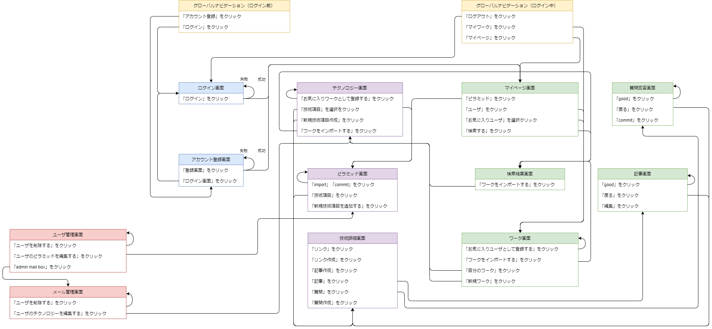

# 開発言語
- ruby on rails

# アプリケーションに取り入れる技術
- お気に入り機能
- devise

# カリキュラム外でアプリに取り入れる技術
- ransack

# アプリケーション実行手順
```
git clone https://github.com/TakeshiAono/technology_pyramid.git
bundle install
rails webpacker:install
rails db:create
rails db:migrate
rails s
```

# ドキュメント類の共有リンク
## カタログ設計書、テーブル定義書、チェックリストなど
https://docs.google.com/spreadsheets/d/1vCe_cmu4S1NYoPXZupQ2RX5F0JeSJOf7jvdnvQJ7UHE/edit#gid=1775028168

## ワイヤーフレーム
https://drive.google.com/file/d/1WFCqzV-Tp8rHO04OJK3SfiudiGbpFqgP/view?usp=sharing

# ER図


# 画面遷移図
